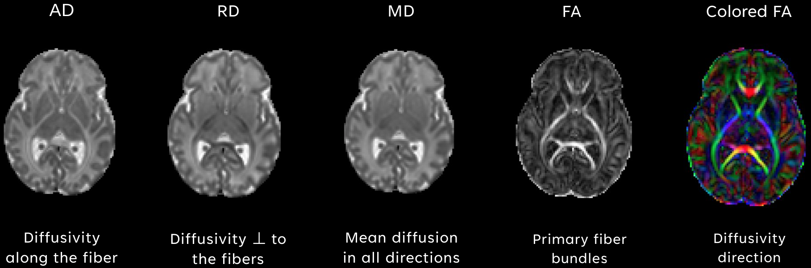
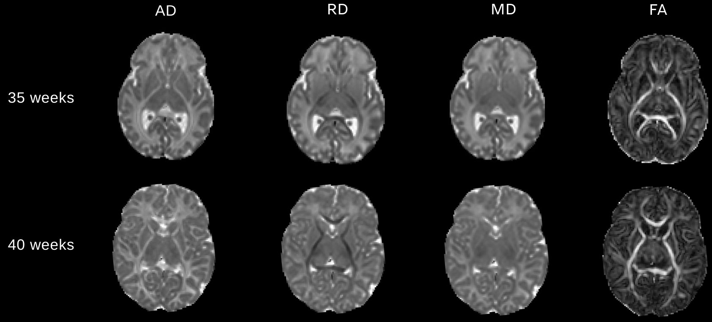
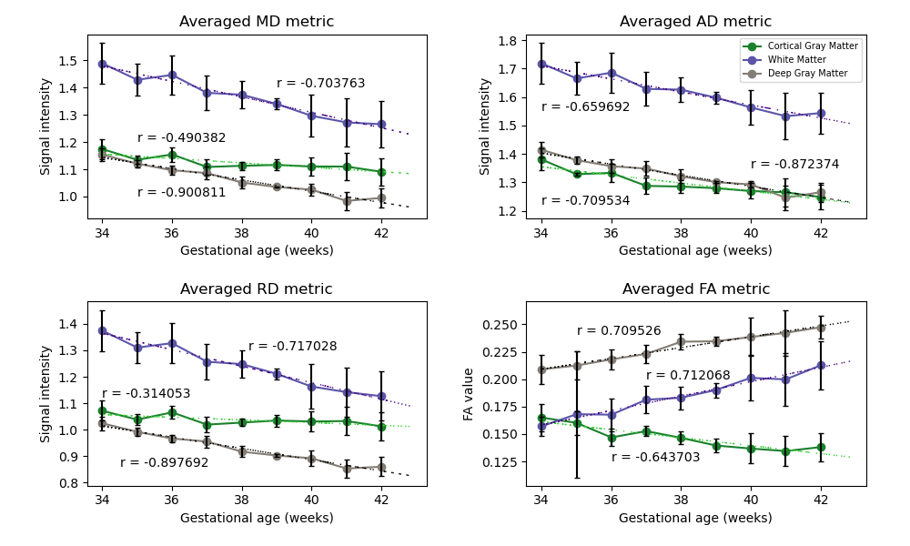

# Evaluation of Neonatal Brain Tissue Development Using Diffusion MRI

*[An Introduction to Python-based MRI Data Analysis](https://github.com/zhangerjun/Introduction_To_Python-based_Biomedical_Data_Analysis): mini-project I/VIII*

Main Team Members: Kylie Xu*, Sara Hernandez*, Erjun Zhang (Mentor), Benjamin De Leener, Gregory Lodygensky, Hélène Nadeau, Sylvia Cox

This mini-project was completed by Kylie Xu, Sara Hernandez and EJ Zhang (mentor), at NeuroPoly at the University of Montreal (Polytechnique), and the MAGIC Lab at the TransMedTech Institute at CHU Sainte-Justine in the summer of 2023 (from June 02, 2023 to August 15, 2023). This was part of the project *An Introduction to Python-based MRI Data Analysis*. Based on this project, Kylie Xu got the Best Presentation Award at the CHU Sainte-Justine 2023 Summer Internship Conference and Sara Hernandez got the 2023 Danieile Tisserand Internship award at Dawson College. (* Contributed equally in this project).

## Introduction
Preterm infants are at a higher risk of developing neurological conditions. Diffusion-weighted MRI (dMRI) is a type of magnetic resonance imaging based on the measurable Brownian motion of water molecules to create contrast in the MRI images. As a noninvasive imaging method, it is a useful image method to help researchers and clinicians understand brain tissue growth.

To my knowledge, few Python resources exist for beginners to access diffusivity in the brain tissues. Thus, we developed this project to use Python to analyze brain tissue development, which could be of interest for dMRI researchers. Students can also use it as a tutorial for exercise. 

## Goal and Hypothesis
### Goal
* Learn Python coding;
* Write DTI reconstruction code with Python;
* Understanding the brain tissue development in infants;
* Democratize the knowledge.
### Hypothesis
Baby development can be characterized by a difference in diffusion MRI (DTI metrics).

We expected to see:
* Brain fibers in neonates mature over time, leading to an increase in anisotropic diffusion (increased FA value);
* AD, RD and MD metrics will decrease with gestational age.

## Methods

### Dataset
In this project, we created a cohort of diffusion MRI data, which consists of $45$ infant from [dHCP dataset 2](http://www.developingconnectome.org/data-release/second-data-release/). All babies were born between $34$ weeks (GA) and $42$ weeks (GA), with exactly $5$ infants per gestational week. The final infant cohort can be found in [here](./data/Baby_sublist_45.xlsx).

Steps:

1. Write DTI reconstruction code based on DIPY;
2. Use DrawEM to segment each brain and get brain tissue segmentation files;
3. Extract averaged diffusion metric values in each brain for each ROIs;
4. Plot curves showing diffusion metric changes along infant ages. 

## Results
### DTI Reconstruction Examples

### Compare DTI Reconstructed Images of Infants with Different Ages

### Changes in Diffusion Metrics with Increasing Gestational Age in Infants

## Reproducibility
### Dependencies
All the experiments can be completed online using either Windows, Mac or Linux computer.
* [Python 3](https://dti-tk.sourceforge.net/pmwiki/pmwiki.php?n=Main.HomePage), [Google colab notebooks](https://colab.research.google.com/) (or [Jupyter notebook](https://jupyter.org/))

* [DIPY](https://dipy.org/): nifti file loader and saver;
* Matplotlib, ipython widgets: data visualization;
* Useful tools: [ITK-SNAP](http://www.itksnap.org/pmwiki/pmwiki.php) for viewing nifti files locally, fsl-bet for creating human brain masks.

### Deliveries
* [Summary of the project](./documents/MiniProject_5_Summary_of_project.pdf): a brief discription of this project; We used this document for the mentorship project application;
* [Final report](./documents/MiniProject_5_Report.pdf): including all details of this project;
* [Project progress records](./documents/Progress_records_of_the_project.pdf): the every working day tasks were recorded for people, who want to reproduce the projects, to follow by themselves.
* [Slides](./documents/MiniProject_5_Slides_at_CHUSJ.pdf), [final presentation](./documents/MiniProject_5_Presentation_at_CHUSJ.mp4), [Abstract 1](./documents/MiniProject_5_abstract1.pdf), [Poster 1](./documents/20230929_Kylie_Evaluation_of_Neonatal_Brain_Tissue_Deve_using_dMRI.pdf).

## Conclusion
We successfully used dMRI data and Python to evaluate neonatal brain tissue development; The results showed that 1) Younger babies have higher brain diffusivity compared to older babies; 2) Older babies have higher anisotropic diffusion characterized by an increase in myelination.

In future, we will use large datasets to predict brain tissue development in more ROIs. Image processing steps will also be used to have more reliable and precise results.

*Acknowledgement*

We extend our sincere gratitude to QBIN for their invaluable financial support for this mini-project and express our deep appreciation to Dawson College (particularly Dr. Hélène Nadeau and Dr. Sylvia Cox) for providing us with the internship and mentoring opportunity. Our heartfelt thanks also go out to TransMedTech (Michelle Poulin) for generously providing us with a conducive and comfortable working environment and support. Finally, we would like to thank our supervisor Dr. De Leener, and Dr. Lodygensky for their support throughout this project.

